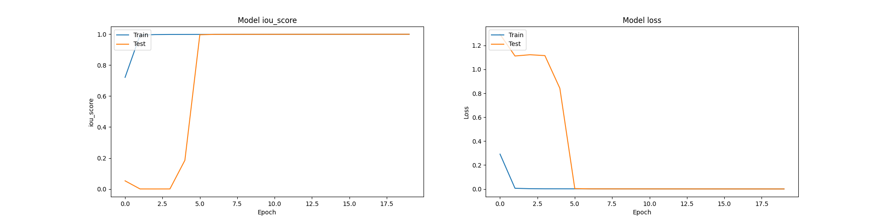
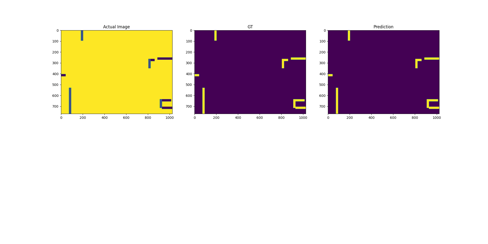

# Project Overview: Smart-Vision-Assist

This smart vision assist is a groundbreaking solution designed to significantly enhance the independence and mobility of visually challenged individuals by helping them navigate unknown environments with greater ease and confidence. For people who are blind or visually impaired, navigating unfamiliar spaces can be a daunting task, filled with uncertainty and potential hazards. This system aims to mitigate these challenges by acting as an "artificial vision," providing real-time guidance and obstacle detection to assist users in safely reaching their destinations.

# How the System Empowers Visually Impaired Individuals:

Navigating through unknown environments poses significant risks for visually challenged individuals, who must rely on canes, guide dogs, or assistance from others. The Vision Assistant System addresses these challenges by:

- Real-Time Environment Understanding: The system processes and analyzes the layout of an environment using advanced floor plan segmentation techniques. It distinguishes between navigable areas and obstacles like walls and furniture, providing the user with a clear understanding of the space.

- Safe Path Planning: Utilizing sophisticated path planning algorithms, the system identifies the most efficient and safest route from the user's current location to their desired destination. This path is dynamically updated as the user moves, ensuring they stay on course even in complex or changing environments.

- Obstacle Detection and Avoidance: As the user navigates, the system continuously scans the environment for obstacles that may not have been initially mapped or that appear unexpectedly, such as people or objects. It then reroutes the user to avoid these obstacles, minimizing the risk of collisions.

# Navigating Unknown Environments

In unknown environments, visually challenged individuals face heightened risks due to the lack of spatial awareness and potential for unexpected obstacles. This system transforms these challenges into manageable tasks by:

- **Creating a Virtual Map:** By segmenting the floor plan into navigable and non-navigable areas, the system effectively creates a virtual map that the user can rely on.
- **Dynamic Updates:** The environment is continuously analyzed for changes, ensuring that the virtual map remains accurate as the user navigates. This is particularly useful in dynamic environments like busy public spaces.

# Technology Used

- Floor Plan Segmentation: The system uses a U-Net architecture with a ResNet-18 backbone for segmenting floor plans into regions that are safe to navigate and those that are obstacles. This model is trained on custom-generated datasets, ensuring high accuracy in various environments.

- Path Planning (A Algorithm)**: The A algorithm is employed to calculate the shortest and safest route through the environment. This algorithm is well-known for its efficiency in finding optimal paths in complex spaces.

- Obstacle Detection (YOLOv3): YOLOv3 (You Only Look Once, version 3) is used for real-time object detection. This allows the system to identify and classify obstacles on the fly, ensuring that the user is alerted to potential hazards as soon as they appear.

- OpenCV for Image Processing: OpenCV is used extensively for processing images and video feeds, extracting contours, and translating model predictions into actionable data for path planning and obstacle avoidance.

# Table of Contents
- [Installation](#installation)
- [Usage](#usage)
- [Project Structure](#ProjectStructure)
- [Floor Plan Segmentation](#FloorPlanSegmentation)
- [Model Config](#ModelConfig)
- [Model Results](#ModelResults)
- [Translating Prediction to OpenCV Pixel Data](#TranslatingPredictiontoOpenCVPixelData)
- [Path Planning - A* Algorithm](#PathPlanning-A*Algorithm)
- [Obstacle Placing, Obstacle Avoidance, and Re-Routing](#ObstaclePlacing,ObstacleAvoidance,andRe-Routing)
- [Output](#Output)
- [Edge Cases and Limitations](#EdgeCasesandLimitations)

# Installation
Prerequisites
Python 3.8 or above
pip
Virtual environment (recommended)

# Clone the Repository
git clone https://github.com/yourusername/vision-assistant-system.git
cd vision-assistant-system

# Create and Activate Virtual Environment
python -m venv venv
source venv/bin/activate  # On Windows use `venv\Scripts\activate`

# Install Dependencies
- pip install -r requirements.txt

Download Pre-trained YOLOv3 Weights
Download the YOLOv3 weights from this link and place them in the /object_detection/weights/ directory.

# Usage
Running the Vision Assistant System

python main.py

This will start the application, and you can follow the on-screen instructions to use the vision assistant system.

# Sample Data
Sample floor plans and corresponding segmented labels can be found in the /data/ directory. You can use these for testing and validation purposes.

# Project Structure

smartvisionassist/
│
├── data/                         # Sample floor plans and segmented labels
│
├── models/                       # Pre-trained models and configurations
│   ├── unet_resnet18.pth         # U-Net model with ResNet-18 backbone
│   └── object_detection/         # YOLOv3 for obstacle detection
│       └── weights/
│           └── yolov3.weights    # YOLOv3 pre-trained weights
│
├── src/                          # Source code
│   ├── floor_plan_segmentation.py # Floor plan segmentation script
│   ├── path_planning.py          # Path planning using A* algorithm
│   ├── obstacle_avoidance.py     # Obstacle avoidance and re-routing
│   └── main.py                   # Main application entry point
│
├── requirements.txt              # Python dependencies
└── README.md                     # Project documentation

# Floor Plan Segmentation

## Model Config
Architecture: U-Net
Backbone: ResNet-18
Epochs: 20
Steps per Epoch: 200
The floor plan segmentation model is trained on custom-generated floor plans. These floor plans were created using OpenCV and NumPy, as manually labeling real floor plans is time-consuming.

## Model Results
Train IoU: 0.99
Validation IoU: 0.99
Test IoU: 0.95
Training curves and other visualizations can be found in the /results/ directory.

# Translating Prediction to OpenCV Pixel Data
After the floor plan is segmented, the model's predictions are processed using OpenCV. Contours are drawn around obstacles (pixels classified as '255'), and each contour is stored in a list of obstacles. These obstacles are then used to construct rectangles, which are crucial for path planning and obstacle avoidance.

# Path Planning - A* Algorithm
The A* path planning algorithm is used to compute the optimal path from the user's position to the destination. The algorithm ensures that the path is both the shortest and avoids obstacles.
Source: User's initial position
Destination: User's desired endpoint
The computed path is then drawn on the canvas, providing a visual guide for navigation.

# Obstacle Placing, Obstacle Avoidance, and Re-Routing
As the user moves along the planned path, the system continuously scans the surroundings for new obstacles using the robot's scanner (represented as a red hollow rectangle in the UI). If an obstacle is detected within a Euclidean distance of 40-60 pixels from the user, the system:

- Adds the detected obstacle to the list of known obstacles.
- Calls the path planning API to compute a new path that avoids the detected obstacle.
- The new path is drawn on the canvas, and the user continues navigating

# Output:

Training Curves:

Output of Prediction:

# Edge Cases and Limitations

Optimal Motion Direction:

The algorithm works best when the initial source is towards the left of the final destination.
It also performs well when the initial source is towards the bottom of the final destination.
Unaddressed Scenarios:

Certain edge cases and complex scenarios are not handled by the current implementation. Future updates will aim to improve these aspects.
Pre-trained Models and Weights
To use the obstacle detection feature, you need to download the YOLOv3 weights from here and place them in the /object_detection/weights/ directory.

